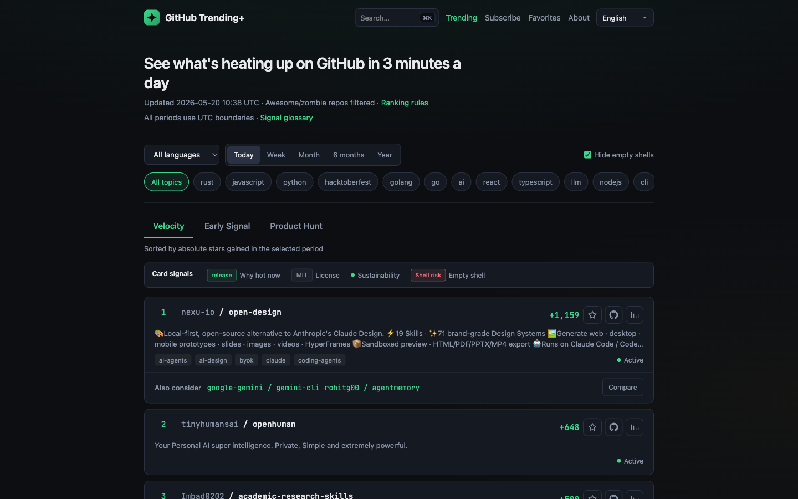

# GitHub Trending+

[](https://github.com/korbinzhao/github-trending-plus/actions/workflows/ci.yml)
[](./LICENSE)
[](https://github-trending-plus-web.vercel.app)
[](./package.json)

**Discover what’s actually heating up on GitHub** — an unofficial, self-hostable alternative to [github.com/trending](https://github.com/trending).

Rank open-source repositories by **star velocity (Δ stars)** and **commit health**, filter noise (Awesome lists, zombie repos), and surface **early movers** before they hit the mainstream chart. Optional **Product Hunt** launch signals, transparent rules, **RSS**, and **11-language** UI.

> Not affiliated with GitHub, Inc. Community-maintained · [MIT](./LICENSE)



**[Live demo →](https://github-trending-plus-web.vercel.app)** · **[Ranking rules](https://github-trending-plus-web.vercel.app/about)** · **[RSS feed](https://github-trending-plus-web.vercel.app/feeds/all.xml)**

---

## Why not just GitHub Trending?

| | Official GitHub Trending | GitHub Trending+ |
|---|--------------------------|------------------|
| Ranking basis | Mostly recent stars in a window | **Velocity** (Δ stars) + **Early Signal** (relative growth under 5k stars) |
| Health & noise | Limited | Commit health, bus-factor hints, **Awesome / shell filters** |
| Cross-platform | GitHub only | Optional **Product Hunt** tab for launch-window signal |
| Transparency | Opaque | Published formulas on the About page |
| Self-host | N/A | **Docker + Postgres**, full monorepo |

Use it when you want a **daily 3-minute scan** of repos gaining traction *now*, not yesterday’s inertia.

---

## Features

- **Velocity** — absolute star gain for today / week / month / 6 months / year (UTC)
- **Early Signal** — high relative growth for repos under 5k stars
- **Product Hunt** — PH upvotes + launch dates; GitHub-linked and product-only entries
- **Health & filters** — commit activity, shell-risk hints, hide empty shells, language & topic filters
- **Repo detail** — star velocity copy, health panel, alternatives strip, PH badge when linked
- **Compare** — side-by-side alternatives with star-history deep links
- **Fuzzy search** — typo-tolerant keyword search over ingested repos (`pg_trgm`)
- **RSS** — `/feeds/all.xml` for readers and automation
- **i18n** — English, 中文, 日本語, 한국어, Español, Français, Deutsch, Português, Русский, العربية, हिन्दी
- **Privacy-first favorites** — browser `localStorage` only (no accounts, no server PII)

---

## Quick start

**Requirements:** Node.js 20+, pnpm 9+, Docker (local Postgres).

```bash
git clone https://github.com/korbinzhao/github-trending-plus.git
cd github-trending-plus
cp .env.example .env
# Edit .env: GITHUB_TOKEN, CRON_SECRET, DATABASE_URL

docker compose up -d
pnpm install
pnpm db:push
pnpm db:trgm
pnpm dev
```

Open http://localhost:3000. Run a first ingest:

```bash
curl -X POST "http://localhost:3000/api/cron/ingest?ranking=true" \
  -H "Authorization: Bearer $CRON_SECRET"
```

Optional Product Hunt ingest (skips automatically when credentials are unset):

```bash
pnpm ph-ingest:once
# Historical PH backfill (one-time):
pnpm ph-backfill:once
```

See [docs/SELF_HOSTING.md](./docs/SELF_HOSTING.md) for details and [apps/web/README.md](./apps/web/README.md) for API routes.

---

## Tech stack

| Layer | Stack |
|-------|--------|
| App | Next.js 15 (App Router), React, next-intl |
| Data | PostgreSQL, Drizzle ORM, `pg_trgm` |
| Ingest | GitHub GraphQL API, optional Product Hunt API, OSS Insight backfill |
| Deploy | Vercel + Neon ([guide](./docs/DEPLOYMENT.md)) or self-hosted VPS |

---

## Monorepo layout

| Package | Role |
|---------|------|
| `apps/web` | Next.js UI + API routes + Cron entrypoints |
| `packages/core` | Ranking, health scoring, shared types |
| `packages/github` | GraphQL ingest, OSS Insight backfill |
| `packages/db` | Drizzle schema + Postgres client |
| `packages/producthunt` | Optional PH ingest & backfill |

Architecture: [docs/ARCHITECTURE.md](./docs/ARCHITECTURE.md)

---

## Documentation

| Doc | Purpose |
|-----|---------|
| [docs/SELF_HOSTING.md](./docs/SELF_HOSTING.md) | Local / VPS self-host |
| [docs/DEPLOYMENT.md](./docs/DEPLOYMENT.md) | Vercel + Neon production |
| [docs/SECRET_AUDIT.md](./docs/SECRET_AUDIT.md) | Pre-release secret scan log |
| [docs/RELEASE_CHECKLIST.md](./docs/RELEASE_CHECKLIST.md) | Maintainer steps before/after going public |

---

## Environment variables

Copy [`.env.example`](./.env.example). **Server-only** (never `NEXT_PUBLIC_*`):

- `DATABASE_URL`, `GITHUB_TOKEN`, `CRON_SECRET`
- `PRODUCTHUNT_*` (optional)
- `NEXT_PUBLIC_SITE_URL` (public canonical/RSS base URL only)

---

## Third-party services & compliance

You are responsible for complying with each provider’s terms when operating an instance.

| Service | Required | Notes |
|---------|----------|-------|
| [GitHub GraphQL API](https://docs.github.com/en/graphql) | Yes (ingest) | Use a PAT with **minimum read scopes** for public repos. Respect [GitHub Terms](https://docs.github.com/en/site-policy/github-terms/github-terms-of-service). |
| [OSS Insight API](https://ossinsight.io/) | Optional (star-daily backfill) | Public API; throttled in code. Follow their usage policy. |
| [Product Hunt API](https://api.producthunt.com/v2/docs) | Optional | Ingest skips when credentials are unset (`ph_ingest_skipped`). |

**Trademark:** Do not imply endorsement by GitHub. This project is community-maintained.

Ranking formula lives in `packages/core` (see About page). License field on cards reflects **each repo’s** SPDX, not this software’s MIT license.

---

## Star & share

If this project helps you discover repos faster, consider **starring the repo** and sharing the [live demo](https://github-trending-plus-web.vercel.app) — it helps other developers find it on GitHub search and awesome lists.

---

## Contributing

See [CONTRIBUTING.md](./CONTRIBUTING.md). Security issues: [SECURITY.md](./SECURITY.md).

## License

[MIT](./LICENSE) — Copyright (c) 2026 GitHub Trending+ Contributors.
